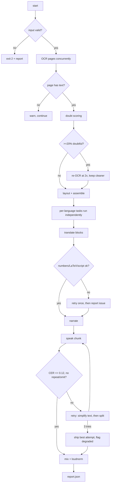

# Workflow and failure handling

```mermaid
flowchart TD
  S[start] --> R{input valid?}
  R -- no --> X2[exit 2 + report]
  R -- yes --> O[OCR pages concurrently]
  O --> Q{page has text?}
  Q -- no --> W[warn, continue]
  Q -- yes --> Z[doubt scoring]
  Z --> T{>=20% doubtful?}
  T -- yes --> U[re-OCR at 2x, keep cleaner]
  T -- no --> L[layout + assemble]
  U --> L
  L --> LANGS[per-language tasks run independently]
  LANGS --> TR[translate blocks]
  TR --> CK{numbers/LaTeX/script ok?}
  CK -- no --> RT[retry once, then report issue]
  CK -- yes --> NR[narrate]
  RT --> NR
  NR --> SP[speak chunk]
  SP --> VF{CER <= 0.12, no repeat/omit?}
  VF -- no --> RS[retry: simplify text, then split]
  RS --> SP
  VF -- yes --> MX[mix + loudnorm]
  RS -->|3 tries| DG[ship best attempt, flag degraded]
  DG --> MX
  MX --> RP[report.json]
```
A language that raises never stops the others; the exit code reflects it (1) and the report says why.
